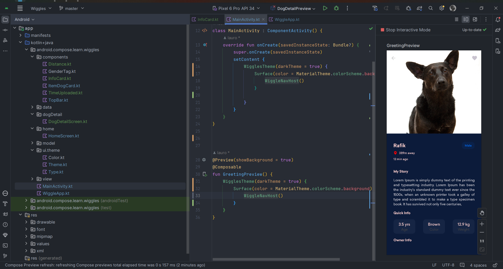

 <div>
       
   </div>

# Wiggles
Wiggles is a small project to practice and learn Android development, using jetpack Compose and Kotlin
## Features

- **Jetpack Compose**: An Android API that helps you build ui components and integartion.

- **NavHost**: used for navigation and past info between screens.

- **Using LazyColumn**: a simples column used to organize the screens components.

## Thank You
A big thank you to [Sanju S](https://github.com/Spikeysanju) for the design and development, it was a great inspiration and great study material.

## Getting Started

Clone the repository:
   ```bash
   https://github.com/lauro-silva44/wiggles_jetpack_compose
   ```
   <div align="center" >
     
   </div>
